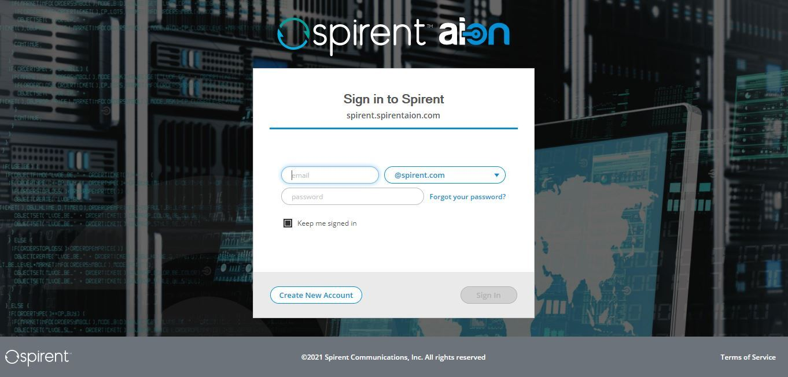

# Spirent vSphere AION Platform Terraform



## Description

Run Spirent AION platform instances.  After Terraform apply finishes you will be able to point your browser at the variable static_ips addresses.

If you would like to configure the Spirent AION platform in a web browser set the variable enable_provisioner=false.  When enable_provisioner=true the instance will be configured.  However, license entitlement & product installation will need to be completed in your web browser (see below).  Login to the platform instance https://<your_ip> using the values of admin_email and admin_password.

### Add License Entitlements
1. From "Settings"  navigate to "License Manager", "Entitlements"
2. Click "Install Entitlements"
3. Use one of the following methods to add entitlements (#1 is prefered)
   1. Login to <your_org>.spirentaion.com and select entitlements to host in the new instance\
      **Note:** Hosted entitlements should be released before destroying the instance.  When entitlements are not released you will need to contact Spirent support to release them for you.
   2. Install a license entitlement file obtained from Spirent support

### Add Products
1. From "Settings"  navigate to "Settings", "Add New Products"
2. Click "Install New Products"
3. Select products and versions and click "Install"

## Prerequisites

Prior to running Terraform the following must be completed:
1.  Install govc
2.  Install genisoimage
3.  Download AION image
4.  Create AION image vSphere Template

### Install govc
[govc](https://github.com/vmware/govmomi/tree/master/govc) is a vSphere command line interface (CLI). Follow installation instructions [here](https://github.com/vmware/govmomi/tree/master/govc#Installation).

Set govc environmental variables specific to your vSphere: GOVC_URL, GOVC_INSECURE, GOVC_USERNAME, GOVC_PASSWORD

Verify vSphere list inventory works:
```
govc ls -l "*"
```

### Install genisoimage
genisoimage is a tool to create ISO images.  This terraform module uses genisomage to pass NoCloud cloud-init configuration to the instances.  Install genisoimage using your package manager.

Ubuntu/Debian:
```
apt-get install genisoimage
```

Redhat:
```
yum install genisoimage
```

### Download AION image
The AION platform OVA image can be downloaded from spirentaion.com in the "AION Downloads" of http::<your_organization>/spirentaion.com.

### Create AION image vSphere Template
Build a template spec file for the OVA image with the following commands:
```
./import-spec.sh "VM Network" > aion-spec.json
govc import.ova -ds=<datastore> -options=aion-spec.json -name=aion_template <aion-platform-image-xxxx.ova>
```


<!-- BEGINNING OF PRE-COMMIT-TERRAFORM DOCS HOOK -->
## Requirements

| Name | Version |
|------|---------|
| vsphere | 1.24.3 |

## Providers

| Name | Version |
|------|---------|
| local | n/a |
| null | n/a |
| random | n/a |
| template | n/a |
| vsphere | 1.24.3 |

## Modules

No Modules.

## Resources

| Name |
|------|
| [local_file](https://registry.terraform.io/providers/hashicorp/local/latest/docs/resources/file) |
| [null_resource](https://registry.terraform.io/providers/hashicorp/null/latest/docs/resources/resource) |
| [random_id](https://registry.terraform.io/providers/hashicorp/random/latest/docs/resources/id) |
| [template_file](https://registry.terraform.io/providers/hashicorp/template/latest/docs/data-sources/file) |
| [vsphere_datacenter](https://registry.terraform.io/providers/hashicorp/vsphere/1.24.3/docs/data-sources/datacenter) |
| [vsphere_datastore](https://registry.terraform.io/providers/hashicorp/vsphere/1.24.3/docs/data-sources/datastore) |
| [vsphere_file](https://registry.terraform.io/providers/hashicorp/vsphere/1.24.3/docs/resources/file) |
| [vsphere_virtual_machine](https://registry.terraform.io/providers/hashicorp/vsphere/1.24.3/docs/data-sources/virtual_machine) |
| [vsphere_virtual_machine](https://registry.terraform.io/providers/hashicorp/vsphere/1.24.3/docs/resources/virtual_machine) |

## Inputs

| Name | Description | Type | Default | Required |
|------|-------------|------|---------|:--------:|
| admin\_email | Cluster admin user email. Use this to login to instance web page.  Default is obtained from AION user information. | `string` | `""` | no |
| admin\_first\_name | Cluster admin user first name. Default is obtained from AION user information. | `string` | `""` | no |
| admin\_last\_name | Cluster admin user last name.  Default is obtained from AION user information. | `string` | `""` | no |
| admin\_password | Cluster admin user password. Use this to login to to the instance web page. | `string` | n/a | yes |
| aion\_password | AION user password for aion\_url | `string` | n/a | yes |
| aion\_url | AION URL. An example URL would be https://example.spirentaion.com. | `string` | n/a | yes |
| aion\_user | AION user registered on aion\_url | `string` | n/a | yes |
| cluster\_names | Instance cluster names.  List length must equal instance\_count. | `list(string)` | `[]` | no |
| datacenter | vSphere datacenter name | `string` | n/a | yes |
| datastore | vSphere datastore name | `string` | n/a | yes |
| dest\_datastore\_folder | Destination datastore folder for cloud-init ISO images | `string` | n/a | yes |
| dest\_dir | Destination directory on the instance where provisining files will be copied | `string` | `"~"` | no |
| enable\_provisioner | Enable provisioning.  When enabled instances will be initialized with the specified variables. | `bool` | `true` | no |
| http\_enabled | Allow HTTP access as well as HTTPS.  Normally this is not recommended. | `bool` | `false` | no |
| instance\_count | Number of AION instances to create | `number` | `1` | no |
| instance\_name | Name assigned to the instance.  An instance number will be appended to the name. | `string` | `"AION"` | no |
| ip\_gateway | IPv4 gateway | `string` | n/a | yes |
| ip\_netmask | IPv4 netmask | `string` | n/a | yes |
| ips | Static IPv4 address list | `list(string)` | n/a | yes |
| local\_admin\_password | Cluster local admin password for instance SSH access.  Will use admin\_password if not specified. | `string` | `""` | no |
| macs | MAC address list.  Automatically set if not specified. | `list(string)` | `[]` | no |
| memory | Size of the virtual machine's memory, in MB | `number` | `"2048"` | no |
| metrics\_opt\_out | Opt-out of Spirent metrics data collection | `bool` | `false` | no |
| mgmt\_plane\_network\_id | Management network ID | `string` | n/a | yes |
| node\_names | Instance cluster node names.  List length must equal instance\_count. | `list(string)` | `[]` | no |
| node\_storage\_provider | Cluster node storage provider | `string` | `"local"` | no |
| node\_storage\_remote\_uri | Cluster node storage URI.  Leave blank for default when provider is local | `string` | `""` | no |
| num\_cpus | Number of virtual processor cores assigned to an instance | `number` | `"2"` | no |
| private\_key\_file | SSH private key file | `string` | n/a | yes |
| public\_key\_file | SSH public key file | `string` | n/a | yes |
| resource\_pool\_id | vSphere resource pool ID | `string` | n/a | yes |
| template\_name | Name of the template created from the OVA | `string` | n/a | yes |

## Outputs

| Name | Description |
|------|-------------|
| instance\_uuids | List of UUIDs assigned to the instances. |
<!-- END OF PRE-COMMIT-TERRAFORM DOCS HOOK -->
